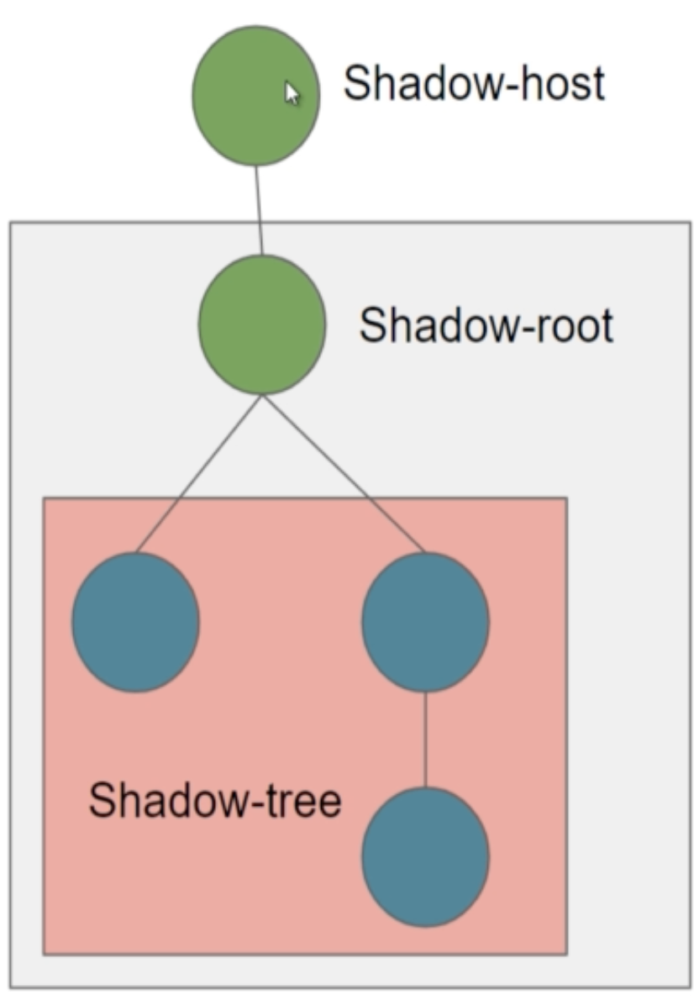

  ---
 
### WEB COMPONENTS

Basic Web components exercises [udemy course](https://www.udemy.com/course/desarrollo-de-aplicaciones-web-con-web-component/)

  ---

- 3 pilares hay que tener en cuenta a la hora de desarrollar web components
    - Template
    - Custom Element
    - ShadowDOM
        - Parte del dom que está encapsulada al resto del Doom y consta de 3 partes.
        - Al estar encapsulado, entre otras cosas, los estilos de fuera del shadow no le impactan.
            - Aunque si aplicas la etiqueta en el estilo directamente, si que podrías cambiarlo desde fuera.
    
